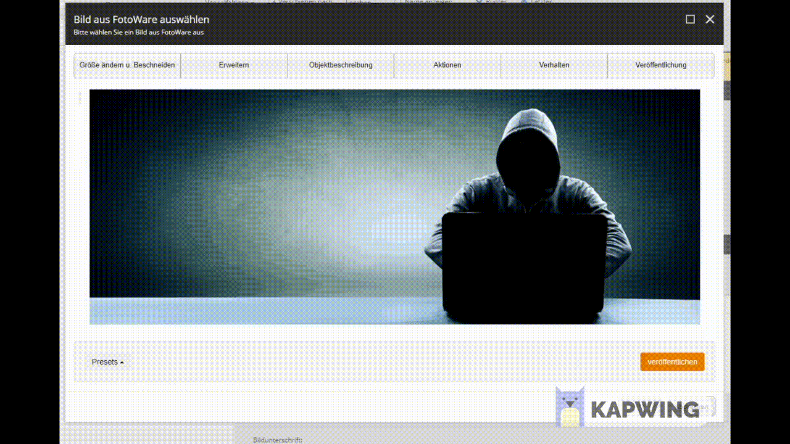

# FotoWare-Sitecore-Integration
## Description
With this plugin you can import FotoWare-images directly to Sitecore.

## Features
+ Select and import single image with FotoWare-Metadata
+ Edit image with FotoWare-Tools
+ Synchronize imported data with FotoWare

## Supported Sitecore-Field-Types
+ Image-Field
+ RichText-Field

## Demo


## Requirements
+ Sitecore 9.1
+ FotoWare with "Non-interactive" authorization (__[more Informations here](https://learn.fotoware.com/Integrations_and_APIs/Authorizing_applications_using_OAuth/03_Authorizing_a_client_using_OAuth_2.0/Non-interactive_application_authorization_with_OAuth_2.0)__)

## Installation Guide
### 1. Set following configurations in Sitecore and replace with your data
```
<setting name="Foundation.FotoWareFields.FotoWare.TenantUrl" value="YOUR_FOTOWARE_BASE_URL" />
```
```
<setting name="Foundation.FotoWareFields.FotoWare.ClientId" value="YOUR_FOTOWARE_NON_INTERACTIVE_CLIENT_ID" />
```
```
<setting name="Foundation.FotoWareFields.FotoWare.ClientSecret" value="YOUR_FOTOWARE_NON_INTERACTIVE_CLIENT_SECRET" />
```
#### Optional configurations:
Set content leanguage (default de-DE):
```
<setting name="Foundation.FotoWareFields.Language" value="YOUR_LANGUAGE" />
```

Set path for import (default /sitecore/media library/FotoWare):
```
<setting name="Foundation.FotoWareFields.TargetPath" value="YOUR_PATH" />
```

## Contributers
+ Mattheo Brajko
